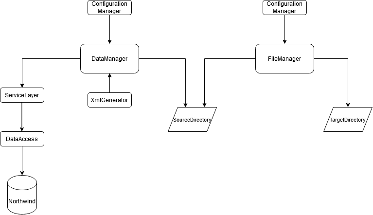
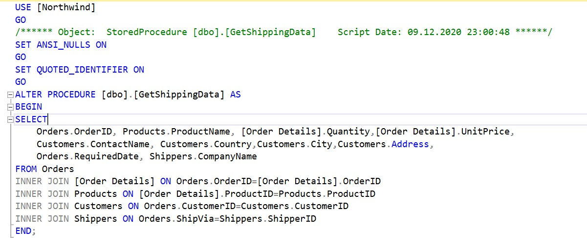
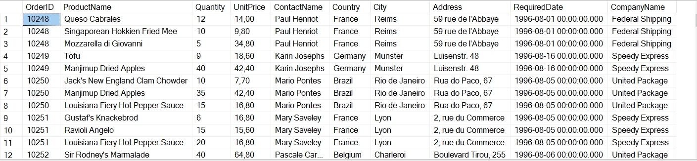
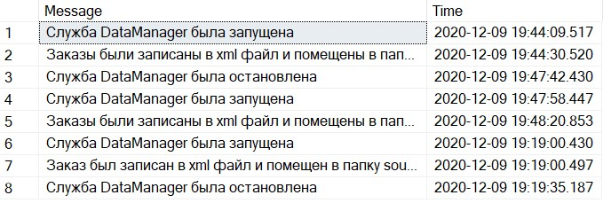
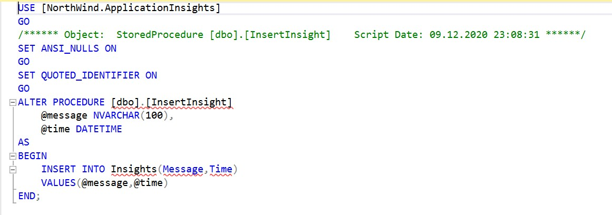
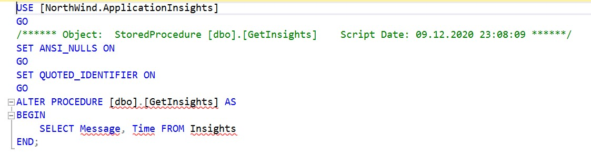
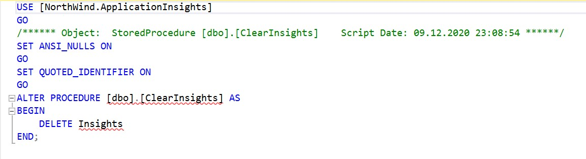

# Lab 4 Service
____
## Вступление
Проект представляет собой 8 проектов, связанных между друг другом. Двумя главными проектами являются Windows-службы(DataManager и FileManager).
FileManager и конфигурацию к нему(проект ConfigurationManager) мы разработали в прошлых лабораторных работах. Теперь настало время получения данных из базы данных
и записи событий и исключений службы в отдельную базу данных. Для этого разработаем службу DataManager, слой DataAccess для работы с базой данных, слой ServiceLayer,
в котором будет описана логика работы с данными полученными из базы данных, а также XmlGenerator, который будет генерировать xml файл и xsd схему на основе полученных данных.
Также дополнительно разработаем слой для работы с базой данных для логгирования.

*Схема*



## DataAccess
____
DataAccess содержит в себе класс [ShippingContext](DataAccess/ShippingContext.cs), посредством которого заполняются репозитории заказов [OrdersRepository](DataAccess/Repositories/OrdersRepository.cs).

*Метод ReadData ShippingContext*
```C#
     public void ReadData()      //Считывание данных из базы данных
     {
          using (SqlConnection connection = new SqlConnection(ConnectionString))
          {
              connection.Open();
              SqlCommand command = new SqlCommand(StoredProcedure, connection)
              {
                  CommandType = CommandType.StoredProcedure
              };
              SqlDataAdapter adapter = new SqlDataAdapter(command);
              adapter.Fill(OrdersSet);
          }
     }
```
Метод взаимодействует с базой с помощью хранимой процедуры



Таблица в базе данных



Далее данные [конвертируются](https://github.com/KostyaTolok/Lab-Service/blob/267bcc3d1866fd393f722d729104c6579a54b4bf/DataAccess/ShippingContext.cs#L39) в IEnumerable и помещаются в репозиторий. ShippingContext использует модель [Order](Models/DataBaseModels/Order.cs) из проекта Models папки DataBaseModels.
Репозиторий находится в [UnitOfWork](DataAccess/Repositories/UnitOfWork.cs) посредством которого [ServiceLayer](Lab-Service/ServiceLayer) взаимодействует с [DataAccess](Lab-Service/DataAccess).
## ServiceLayer
____
[ServiceLayer](Lab-Service/ServiceLayer/) содержит в себе класс [OrderService](ServiceLayer/Services/OrderSevice.cs), который содержит логику преобразования [Order](Models/DataBaseModels/Order.cs) в [OrderDTO](Models/DTOModels/OrderDTO.cs)(Data transfer object), он преобразует несколько заказов один, вычисляя общую
стоимость заказа, и собирая все имена продуктов в один список, получая единый объект заказа [OrderDTO](Models/DTOModels/OrderDTO.cs).

*Метод перевода нескольких заказов в один*
```C#
        private OrderDTO ConvertOrderToOrderDTO(IEnumerable<Order> orders)  
        {
            if (orders == null)
            {
                throw new Exception("Заказ не найден. Ошибка Service Layer.");
            }
            if (orders.Contains(null))
            {
                throw new Exception("Одно из полей заказа не установлено. Ошибка Service Layer.");
            }
            decimal totalPrice = 0;
            List<string> names = new List<string>();
            foreach (Order order in orders)
            {
                totalPrice += order.UnitPrice * order.Quantity;
                names.Add(order.ProductName);
            }
            Order firstOrder = orders.First();
            return new OrderDTO()
            {
                Address = firstOrder.Address,
                City = firstOrder.City,
                CompanyName = firstOrder.CompanyName,
                ContactName = firstOrder.ContactName,
                Country = firstOrder.Country,
                Id = firstOrder.Id,
                OrderPrice = totalPrice,
                ProductNames = names,
                RequiredDate = firstOrder.RequiredDate
            };
        }
```
Методы [GetOrder](https://github.com/KostyaTolok/Lab-Service/blob/5c5bb9fa36153d64b7ab0b2b03dc4113e12ba9f3/ServiceLayer/Services/OrderSevice.cs#L21) и [GetOrders](https://github.com/KostyaTolok/Lab-Service/blob/5c5bb9fa36153d64b7ab0b2b03dc4113e12ba9f3/ServiceLayer/Services/OrderSevice.cs#L65) возвращают либо один [OrderDTO](Models/DTOModels/OrderDTO.cs), либо перечисление [OrderDTO](Models/DTOModels/OrderDTO.cs). Далее данные передаются на уровень [DataManager](Lab-Service/DataManager) в [XmlGenerator](DataManager/XmlGenerator.cs).
## XmlGenerator
____
[Здесь](DataManager/XmlGenerator.cs) данные преобразуются в xml файл, а также на их основе создается xsd схема. Для этого [преобразуем](https://github.com/KostyaTolok/Lab-Service/blob/0f775a17c779a43b44dda0cc6b94d042c55455e2/DataManager/XmlGenerator.cs#L68) данные из IEnumerable в Datatable. А после на основе сформируем xml и xsd файлы.

*Метод метод генерации xml и xsd файлов на основе всех заказов*
```C#
        private void ConvertOrdersToXml()
        {
            IEnumerable<OrderDTO> orderDTOs = orderService.GetOrders();
            DataTable dataTable = OrdersDTOToDataTable(orderDTOs);

            dataTable.WriteXml(Path.Combine(options.PathOptions.SourcePath, options.PathOptions.XmlFileName + ".xml"));
            dataTable.WriteXmlSchema(Path.Combine(options.PathOptions.SourcePath, options.PathOptions.XsdFileName + ".xsd"));

            insights.InsertInsight("Заказы были записаны в xml файл и помещены в папку source");
        }
```

*Метод генерации xml и xsd файлов на основе одного заказа*
```C#
        private void ConvertOrderToXml(int id)
        {
            OrderDTO orderDTO = orderService.GetOrder(id);
            List<OrderDTO> orderDTOs = new List<OrderDTO>() { orderDTO };
            DataTable dataTable = OrdersDTOToDataTable(orderDTOs);

            dataTable.WriteXml(Path.Combine(options.PathOptions.SourcePath, options.PathOptions.XmlFileName + ".xml"));
            dataTable.WriteXmlSchema(Path.Combine(options.PathOptions.SourcePath, options.PathOptions.XsdFileName + ".xsd"));

            insights.InsertInsight("Заказ был записан в xml файл и помещен в папку source");
        }
```
В конце концов файлы попадают в папку Source, где уже начинает работать ранее написанная служба [FileManager](Lab-Service/FileManager).
## ApplicationInsights
____
[ApplicationInsights](ApplicationInsights/ApplicationInsights.cs) записывает события и исключения программы в специально созданную базу данных.



Для этого она использует хранимую процедуру InsertInsight.



И метод [InsertInsight](https://github.com/KostyaTolok/Lab-Service/blob/5454049dcd791103b76ca1e851243e3a2762da86/ApplicationInsights/ApplicationInsights.cs#L20).

Также AppInsights может записать все события и исключения в xml файл используя хранимую процедуру.



Cоответствующий [метод](https://github.com/KostyaTolok/Lab-Service/blob/5454049dcd791103b76ca1e851243e3a2762da86/ApplicationInsights/ApplicationInsights.cs#L45).

А также очистить базу данных



Используя метод [ClearInsights](https://github.com/KostyaTolok/Lab-Service/blob/5c5bb9fa36153d64b7ab0b2b03dc4113e12ba9f3/ApplicationInsights/ApplicationInsights.cs#L70).

На этом все, спасибо за внимание! :cat:
